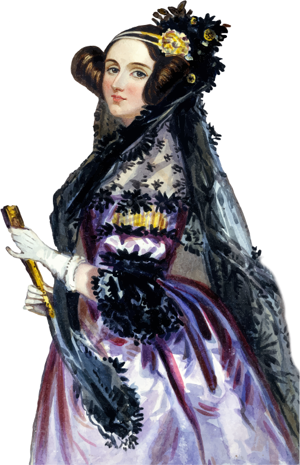

  

<h2 align="center"> Comunidade das minas de CC! <3 </h2>
 

 
  
  
  

## Do que se trata?

Com o intuito de agregar no curso de Ciência da Computação e na trilha das ingressas do curso, surgiu o CC Girls. Buscamos dar o sentimento de pertencimento às mulheres do curso, criar uma comunidade colaborativa, ativa e com trocas entre as estudantes. Grupo de estudos, projetos, compartilhamento de conhecimentos e experiências é o que oferecemos :) 

> **Atenção:**  Quer sugerir? Entre em contato por XXXX

## Ciência da Computação, UFFS

Gostou da idéia? Veja mais sobre o curso e outras iniciativas!

 
  

## Licença

Esse projeto é licenciado nos termos da licença open-source [Apache 2.0](https://choosealicense.com/licenses/apache-2.0/) e está disponível de graça.

 
  

> Feito com: Docsify
> Imagens: Undraw
> Icones: Flaticon

<small>Autora: - <a href="https://github.com/DanieleKaroline">Daniele K.</a></small>