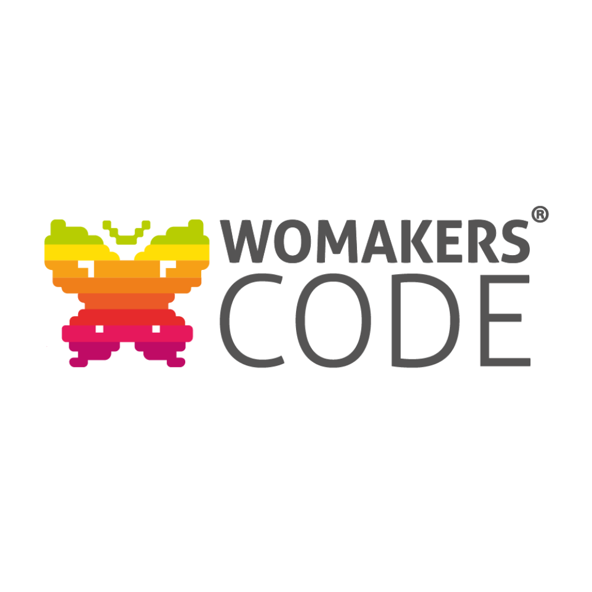

# WoMakersCode

A WoMakersCode é uma organização dedicada a impulsionar mulheres na área da tecnologia. Oferecemos diversas iniciativas e programas, como meetups (eventos), workshops e mentorias, abordando habilidades técnicas e competências pessoais (soft-skills), incentivando o networking e preparando-as para carreiras em tecnologia.

Além de apoiar mulheres, colaboram com empresas comprometidas com a equidade de gênero.

> **Acesse:** https://womakerscode.org/

<small>Autora: - <a href="https://github.com/DanieleKaroline">Daniele K.</a></small>